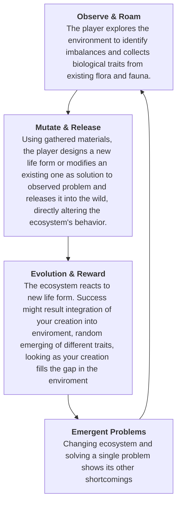

# Wilder - Game Design Document

> [!info] Elevator Pitch
A Forest Guardian wakes after a long time to set things right in a world where nature has fallen out of balance.

| Date | Version | Changes Made |
| :---- | :---- | :---- |
| 2026-04-28 | 0.1.0 | Initial draft based on Short GDD |
**Date**: When was this version written or updated

**Version**: Use semantic versioning if possible (e.g., 0.3.1), to show iteration and maturity.

**Changes**: List in quick bullet points, the additions and changes to each section of this document.

---

### **1. Project Info**

1. **Game Title**: Wilder (Placeholder)
2. **Author / Team**: Wojciech Wroński, Jonatan Ulatowski
3. **Platform(s)**: PC ([TBD - additional platforms])
4. **Engine / Tools**: S&ndbox, **Design Tools:** Obsidian, **Organization:** GitHub
5. **Monetization Model**: [TBD - e.g., Premium/Buy-to-play]

---

### **2. Game Overview & Vision**

###### High Concept
A management game where you grow and mutate a mythical ecosystem, becoming its guardian or tyrant.  

###### Design Pillars
 1. A simple start - one job at a time, a first problem solved. 
 2. Complications should arise from player completion or later on result of solved problems or due to problem solving. 
 3. Learning new mechanics not due to tutorials but during the emergent problem solving. 

###### Game Summary:
Players take on a role of an ancient forest guardian. The core experience is about observing, learning and then tending to the living, breathing environment. Observing imbalances, roam for resources, mutate new life forms (flora and fauna), and release them to "fix" the world. 
	*It combines the calming vibe of nature management with the deep optimization loops found in games like Factorio.*

###### Player Journey Snapshot
   * **The First 10 Minutes:** 
    You appear in the middle of an unknown place, around you are different plants and beasts. You see them act in different ways, some hunt each other, others are large herbivores, some others small and fast. So you travel that land, investigating, looking at what is going on around you. 
	In doing so, you unlock traits of creatures and plants you seen, and then time comes, either a dying beast or fickle decision you make your [[The Created]], which kickstarts your change in the environment. 
	A single beast becomes two, then three, and more, you see them integrate or fight the land. Before you emerges a choice, integrate into the current environment, or dominate it with horrors. 
   * **Late-Game Session:** 
   Problems emerging from your own changes to the environment.
	   Your [[The Created]]s spread, you can see them interacting more and more, some emerge dominant, predators are too strong and they kill more and more of others? make stronger herbivores, you didn't? maybe a cannibal traits appeared for your predator species. The herbivores ate all plants? you have to make the plants spread and grow more aggressively. 

###### Unique Selling Points (USP)
   * **Emergent Gameplay & Story:** Interactions between mutated species create stories without scripted dialogue.
   * **The "Completion" High:** Providing the deep gratification of a perfectly completing tasks, solving problems that emerge during playthrought.
   * **Aesthetic:** Smooth shapes, Rainworld style with a tad more defined background.
   
###### Target Audience
Cozy gamers (if we make the mechanical interactions graphic as well), Factory gamers. 

###### Genre & Inspirations
   * **Genre:** Ecosystem Management / Automation.
   * **Inspirations:** *Factorio* (Progression/Addiction), *Rain world* (AI/Visuals), *The Completion Addiction*.
   
###### Tone & Look & Feel
Smooth, "blobby" life forms, defined backgrounds, and a tonal environmental shift from "broken/silent" to "thriving/alive."

---

### 3. Core Gameplay Design

###### **Core Gameplay Loop**: 

###### **Player Progression**:
- **Visual spread** Whenever you open the overview of the explored map, you can see land where your creations live and spread. The more of ecosystem was made by you the deeper the tint. 
- **Playground Knowledge** As you make changes to your [[The Created]]s, you may get additional traits either from exploration or due to some creatures evolving other traits for themselves to survive. 
> [!warning] Evolution & Traits
> It should be hard to trigger an evolution in an animal in order to add actual weight to it. The traits from natural evolution should be something not seen by player. (adding traits that must be attained from evolution, cannot be gained in baseline world).

###### **Controls & Input**
Slower paced gameplay, where mainly you will spend your time in looking through traits and in [[The Created]] modificator/creator. Keyboard for character movement and maybe key shortcuts, mouse for navigating UI. 
- **Direct Control** with **Camera-Relative Movement**. Inputs are mapped to screen space (e.g., W always moves the character toward the top of the viewport), ensuring intuitive navigation regardless of character orientation."
- **Traits Screen** [TBD] minimalistic UI navigable with a mouse, clicking animals shows traits, traits you know show whenever you hover/click bottom of screen. 

###### **Difficulty & Challenge**
Based on the biome in which player currently resides.
Different biomes will hold different traits, ground fertility (for plants) and require different approach. 
[Should we make player character mortal? well... killable by animals and enviroment]

###### Feedback system
1. **Visual**: Observing [[The Created]] spreading, performing its behaviors. Seeing the ecosystem color on map changing to yours/integrated with yours. 
2. **Logs**: You can look into logs of your [[The Created]]s, what they did or are doing, where they are on map, focusing map onto them [Maybe controlling them as if they were playable character?]
3. **Audio**: Each time new trait evolves in your creation you get a notification sound, sounds for movement, changing sounds of the environment depending on what is in it (Different entities will make different sounds)

### 4. Game Mechanics & Systems
This section breaks down the underlying rules and systems that support the gameplay loop.

The mechanics written in *Cursive* are optional and to [TBD]

##### **Core Mechanics**:
The mechanics prevalent in the core gameplay loop. 

###### Observation & Scanning:
The primary method for gathering data. By interacting with or "focusing" on a life form, the player uncovers its genetic traits, biological needs, and role in the current ecosystem. This feeds the genetic library used for later creations.

###### [[The Created]]
The act of introducing traits to an already living, weakened beast, or creating a new life from scratch. 

You chose traits to become a part of your creature and once done you hold a creature until you release them. 
Creature preset is saved in some way to allow quick creation in the future and iteration to make races of the same species. 

> J: you may use resource in order to increase the amount of traits to be placed on the beast?
> J: I want to keep the creation light, so it can be done on the fly. At same time with a choice of entering more detailed editor. Maybe where some beast behavior changes are noted. 

###### Life-Form Deployment:
The act of introducing a creature or plant into the world. Deployment is location-sensitive; the player must consider local resources, predators, and environmental conditions (temperature, moisture) to ensure the new life form survives and fulfills its purpose.

###### *Environmental Tending:*
Direct physical interaction with the world. The player can move obstacles, clear blockages, or manipulate resources (like water or light) to shape the environment and prepare biomes for specific biological goals.
> J: *Maybe could do this as simply plant life? you change plant life and it is the automatic environmental editor depending on traits it has been given.* 

###### Ecosystem Feedback (Visual/Systemic):
A passive mechanic where the world "speaks" to the player. Success is signaled by vibrant colors, increased activity, and specific audio cues, while imbalances are reflected through "silence," muted colors, or aggressive population spikes.

***

##### **Side Mechanics**[TBD]
The optional or supplementary mechanics like fishing, mini-games, base-building, etc. They are not part of the core loop, but they provide variety. 

###### Taking on [[The Created]] form
You take on a form of your creation and are able to roam the map as it, doing the same actions as they would be. Possibly directing their spread/migration. 

###### [[The Created]] form actions
Whenever hunting or living as a [[The Created]] you can get unknown traits from beasts and plants you eat. 

***

##### Interactions
###### Map interactions
Mining, breaking trees, basically allowing the player to do slow one at a time changes to the environment. 
- Mining - not deep into the earth (i think) basically being able to dig river beds, or rising ground to have a higher terrain. 
- Breaking vegetation - allows us to make biomes that are difficult to move through, like thick forests etc. 
Map interactions open doors for traits which will enable them for created entities, beasts that dig or make small hills for themselves, that ram into vegetation to get the food (leafs from the tree crowns etc.)

##### Economy & Resources [TBD]
###### Strand
Whenever you encounter a new animal, find a carcass etc. you gain strands that are used to put more traits into one creature. 
> J: Maybe make mutating creatures not take any of that resource but creation, a blank slate to require strands (to weave together the body of your creation). Allows for more freedom in choice and gives player some additional goals to do, adds weight to roaming even in the late game. 

### Narrative, World & Characters

##### Worldbuilding
A world of medieval fables, mythical creatures and worlds. 

##### Story - [TBD when the foundations exist]

