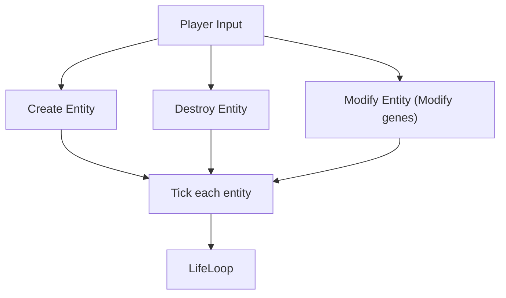
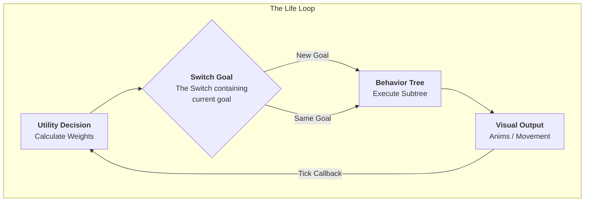
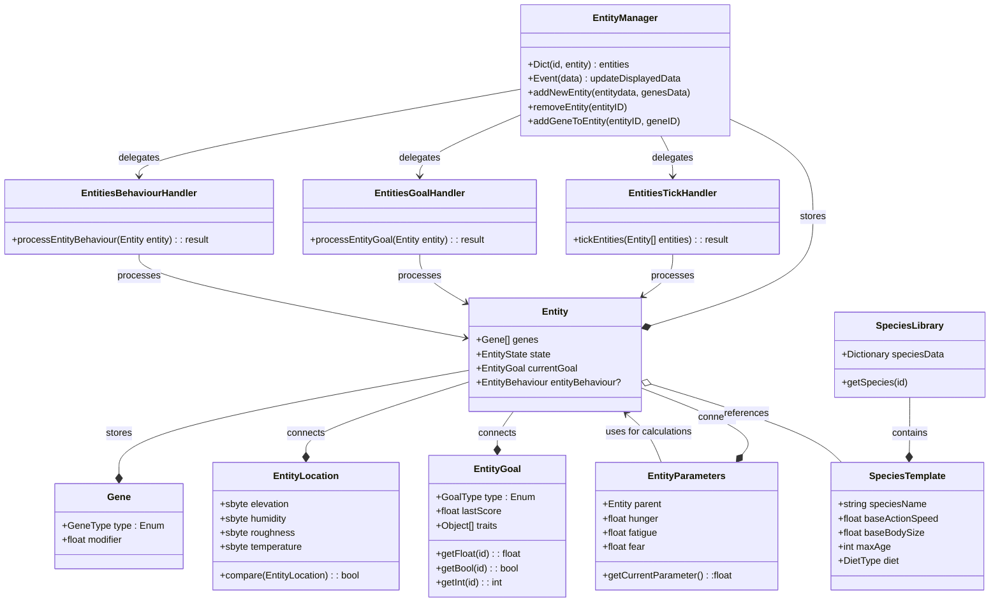
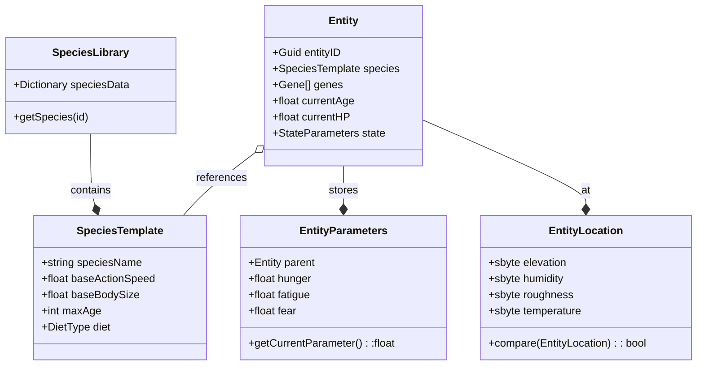
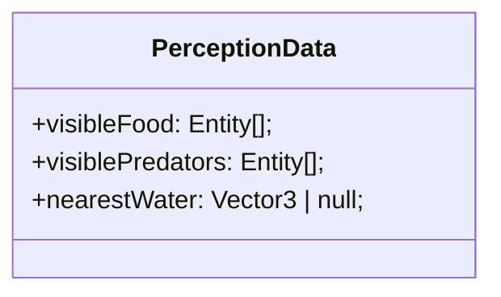

### General Loop
From [[TDD_Animals]]

##### Life Loop

### System Architecture

### Architectural Legend
#### 1. The Data Layer (The "What")
* **Entity:** A unique ID that represents a creature. It is a "Passive Container"—it holds data but does not contain logic.
* **EntityData/State (The "Pulse"):** The current dynamic values of the creature (Hunger, Health, Position). These change every frame.
* **Genes (The "DNA"):** The permanent traits of the creature (Brave, Fast, Glutton). These act as **Math Modifiers** for everything else.
* **Intent Holders (`currentGoal` & `entityBehaviour`):** The "bookmarks" that store what the animal decided to do and exactly which step of the process it is currently on. 
    * **lastScore:** Stored within the `currentGoal`, it remembers the "Value" of the current task to calculate **Decision Inertia**.

#### 2. The Processing Layer (The "How")
* **EntityManager (The "Registry"):** The central database. It knows where every entity is and provides the list of animals to the Handlers. 
* **Handlers (The "Systems"):** Specialized workers that process all entities in batches.
* **EntitiesTickHandler (The "Metabolism"):** Updates the `EntityState`. It increases hunger over time based on the Genes.
* **PerceptionSystem (The "Senses"):** The "Input" for the brain. It fills the entity's memory with nearby objects (Food, Water, Predators) using the "Smell" (Proximity) logic.
* **EntitiesGoalHandler (The "Strategy"):** The **Utility Brain**. It looks at the `EntityState` and `Perception` to decide on a high-level **Goal** (e.g., "I want to Eat"). It writes this into `currentGoal`.
* **EntitiesBehaviourHandler (The "Tactics"):** The **Behavior Tree**. It looks at the `currentGoal` and executes the physical steps (e.g., "Walk to X, play animation, reduce food HP").

#### 3. Goal Inertia (The "Focus")
To prevent "Goal Flickering" (rapidly switching between two similar needs), the brain uses a **10% Decision Inertia** rule:
* A new goal is only selected if its score is **1.1x higher** than the score of the current goal.
* **Exception:** If the current goal is `Idle` or the new goal is `Fear` (Panic), the switch is immediate.

###### BT vs Utility Boundary
Different types of goals/actions will have a different interruption thresholds. 
* **Movement:** Always interruptible. The animal will change direction immediately if the Goal switches.
* **Atomic Actions:** Physical actions like "Eating a bite" or "Laying down to sleep" are non-interruptible. The BT must finish the current leaf node before checking for a Goal switch.
* **Emergency Cancel:** If the new Goal is `Fear`, it overrides "Atomic Actions" to ensure immediate survival response.

#### 4. The Communication Layer (The "Who")
* **InputManager:** Converts player clicks/keys into commands for the `EntityManager` (e.g., "Spawn Entity" or "Modify Genes").
* **OutputManager:** Listens to the `EntityState` and tells the Game Engine what to draw on the screen (Animations, UI Bars, Particles).

#### 5. Time Context - Tick
The simulation is **Deterministic and Tick-based** to ensure consistency across different frame rates and support fast-forwarding.
* **Tick Rate:** 1 Tick = 0.1s (10 ticks per second).
* **Implementation:** Uses a **Logic Buffer** (Time Bucket). Real-time (`Time.Delta`) is added to a buffer; whenever the buffer exceeds 0.1s, one "Logic Tick" is processed.
* **Scaling:** Since it uses `Time.Delta`, the simulation naturally pauses when the game is paused and speeds up when `TimeScale` is increased.
> [!warning] Sandbox.Time
> Using Sandbox.Time would work if we were not going to be trying to speed up simulation, additionally it would count the time based on the framerate, so each pc would get a different time passage unless we would lock the fps amount. 

### Parameters

#### Species Library (Static Data)
These values never change during the game. All rabbits share these.
- **SpeciesID:** (e.g., "Rabbit_01")
- **Genes:** Genes shared by all of that species. 
- **Max Age:** Total life expectancy in game ticks.
* **BaseActionSpeed:** The "default" speed for this species.
* **BaseBodySize:** How big this species typically gets.
* **DietType:** (Enum: Herbivore, Carnivore, etc.)

#### Entity Instance (Personal Data)
- **EntityID**
- **Genes:** Species library genes, with additional personal genes. 
- **Current Age (0.0 - 1.0)**
    - `0 - newborn`, `1 - death of old age`, `0.2 - adulthood`, `0.5 - end of reproductive age`
- **ActionSpeed (0.0 - 1.0)**
	- *Closer to 0, the slower it is, closer to 1 the faster it is.*
	- **Impact Logic:** Should be modified by Age (babies/elderly are slower) and Fatigue.
	- **Formula Idea:** `BaseActionSpeed * (Age Curve) * (1.0 - Fatigue)`
- **BodySize (1 - 10)**
    - *The visible size of the creature.*
    - **Growth Logic:** This shouldn't be a flat number. It should be TargetSize (Gene) * AgePercent.
    - **Impact:** Larger size = higher food requirement? (Big engines need more fuel).
- **Max HP (1 - 10)**
    - Formula: `BodySize`
- **Current HP**
	 - *Damage is substracted from Current HP (avoiding healing by sleeping/fatigue lowering)*
	 - *Recovery: passively by 0.1 per 10 ticks, 0.5 for completed feeding, 0.3 per 10 ticks when sleeping*
- **Fear(0.0 to 1.0)**
	- *0.0: tranquil*
	- *0.5: scared, in smaller/skittish animals causes them to run*
	- *0.9 to 1.0: terrified, even bigger animals will be taking actions to run/take actions in response to fear*
	- *Recovery: 0.1 per tick, starts ticking down when not in danger*
- **Fatigue(0.0 to 1.0)**
	- *0.0: rested*
	- *1.0: exhausted, passes out forced to fall asleep*
- **Hunger (0.0 to 1.0)**
	- *0.0: fully satiated*
	- *1.0: starving, triggers hp loss 1 per 10 ticks*

### Genes

#### Math behind Genes
How Genes (DNA) modify the Utility (Decision Making), for full explanation check [[AI]].

| Gene Type      | Math Operation                       | Game Feel                    |
| :------------- | :----------------------------------- | :--------------------------- |
| **Multiplier** | $GoalScore = Need \times k$          | **Importance** (Priority)    |
| **Exponent**   | $GoalScore = Need^{k}$               | **Urgency** (Response Curve) |
| **Offset**     | $GoalScore = Need + k$               | **Temperament** (Baseline)   |
| **Threshold**  | $Need < k \rightarrow GoalScore = 0$ | **Tolerance** (Deadzones)    |
| **Input Mod**  | $Rate = BaseRate \times k$           | **Physicality** (Metabolism) |
> [!warning] Min $k$ value
> NEVER GO BELOW $k = 0.3$
> It will cause the behavior to constantly trigger even if there is no reason around the creature. 

##### Math Legend
- **Need:** The raw value of a requirement (Hunger, Fear, etc.), from **0.0** (none) to **1.0** (critical).
- **GoalScore:** The final "desire" to act. The animal picks the goal with the highest score.
- **k:** The "Gene Strength" - the actual number saved in the DNA.
- **BaseRate:** How fast a need naturally grows (e.g., standard hunger speed).
- **Rate:** The new, modified speed after the gene is applied.

#### Genes
> [!note] The "Range"
> There will be only a single "Fear Response" gene that will change its name based on the $k$ value. 
> - If $k$ is between 1.5 and 3.0 $\rightarrow$ The UI displays the name "Brave".
> - If $k$ is above 5.0 $\rightarrow$ The UI displays the name "Heroic".
> - This is great for evolution because $k$ can slowly grow from 2.0 to 5.0 over generations.

###### Fear Response
Response to perceived danger, the threshold of which triggers the response mechanics like for example fleeting. 

| ID    | Fear Response | K for Exponent | Descriptive                                      |
| ----- | ------------- | -------------- | ------------------------------------------------ |
| FR_01 | Skitterish    | 0.5            | Panics at small threats, ($0.1 \rightarrow 0.3$) |
| FR_02 | Default       | 1.0            | Linear response to danger                        |
| FR_03 | Brave         | 2.0            | Ignores small threats, acts at mid-range         |
| FR_04 | Heroic        | 5.0            | Only reacts when threat is touching them         |
###### Fatigue 
How quickly will they want to search for a save place and sleep before exhaustion. 

| ID    | Name      | K for Exponent | Descriptive                                                      |
| :---- | :-------- | :------------- | :--------------------------------------------------------------- |
| Fa_01 | Drowsy    | 0.5            | Wants to sleep very early; feels fatigue's "weight" immediately. |
| Fa_02 | Default   | 1.0            | Linear response to fatigue.                                      |
| Fa_03 | Sturdy    | 2.0            | Ignores mild tiredness; only seeks sleep when moderately tired.  |
| Fa_04 | Insomniac | 5.0            | Stays active until the absolute last second before passing out.  |
> [!warning] Sleep planning
> It would be good to give some benefit for sleeping earlier, the idea being that having more time to perform sleep task will allow the animal to find a save place. 
> 

###### Hunger
How quickly they get hungry. 

| ID    | Name          | K for Exponent | Descriptive                                                       |
| :---- | :------------ | :------------- | :---------------------------------------------------------------- |
| Hu_01 | Gluttonous    | 0.5            | Desperately looks for food even when slightly peckish.            |
| Hu_02 | Default       | 1.0            | Linear response; starts eating at mid-hunger.                     |
| Hu_03 | Patient       | 2.0            | Ignores stomach growls; prefers doing other things until hungry.  |
| Hu_04 | Ascetic       | 5.0            | Only eats when literally starving and losing HP.                  |

###### Physical Traits
These genes use the **Input Mod** ($k$) math. They modify the base stats of the species. 

| ID    | Trait        | K (Multiplier) | Descriptive                                           |
| :---- | :----------- | :------------- | :---------------------------------------------------- |
| Si_01 | Body Size    | 0.5 to 2.0     | Multiplies Target Size. Affects Max HP and food cost. |
| Sp_01 | Action Speed | 0.5 to 1.5     | Multiplies movement and action execution speed.       |
| Li_01 | Longevity    | 0.8 to 2.0     | Multiplies the Max Age of the entity.                |

### (ForLater)Perception & Sensory systems
To keep it simpler then messing with LOS or other BS, we will be using proximity-based detection. 

##### Query logic
Every **PerceptionInterval**, the animal asks the **SpacialSystem** 
	*"What are the nearest entities within **SmellRadius**"*
- **Logic:** Simple distance check between **Entity.Position** and **Target.Position**

##### Data Storage
Results are stored within the list inside the **Entity** as **PerceptionData**

##### Utility Interaction
[[AI#Utility Layer (The "Brain")|Utility]] uses this data to calculate weights 
	*Examples:*
	- If *visiblePredator* is not empty, set *FearWeight* to 1.0
	- If *visibleFood* has 3 items, set *FoodAvailabilityScore* to 1.0 
	*Examples:*
	- If *visiblePredator* is not empty, set *FearWeight* to 1.0
	- If *visibleFood* has 3 items, set *FoodAvailabilityScore* to 1.0

# Proposition

###### Dietary Genes
These genes act as the "Major DNA" that defines the core metabolic identity and behavior of the creature. They use the **Input Mod** math to modify base metabolic rates and inform the Utility Brain's decision logic.

| ID    | Diet Type | K (Multiplier) | Descriptive                                                              |
| :---- | :-------- | :------------- | :----------------------------------------------------------------------- |
| Di_01 | Herbivore | 1.0            | Standard metabolic rate; prioritizes plant-based food sources.           |
| Di_02 | Predator  | 0.7            | Slower hunger growth (efficient but high-cost hunt); targets other entities. |
| Di_03 | Omnivore  | 1.2            | Faster hunger growth; can utilize any food source.                       |
