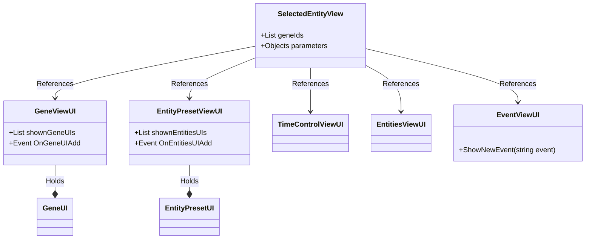

### What is needed
- View list of animals
	- Grouping by Bioms, Genes
	- Filtering
	- Edit the entity
	- Remove the entity
- View of messages what happened
	- Grouping
	- Filtering
	- Using a event storage system
- Simulation Speed control
- Preinstaled and saved by player entity templates
- Gene list
	- add to currently edited entity 
- Currently edited entity type
	- Name
	- Release into wild and where
	- Remove installed genes
	- Cancel edit
- Currently selected event more info
### What is not needed for prototype
- Grouping, filtering, just show a list
- Events just as a string
- gene and preset list can be a expandable list
### First draft

![[UI draft 1]]

### Time Control

**Visual**
![[UI time control draft]]

**Code**
- On each button pressed --> notify TimeManager

### Event View

**Visual**

**Code**
