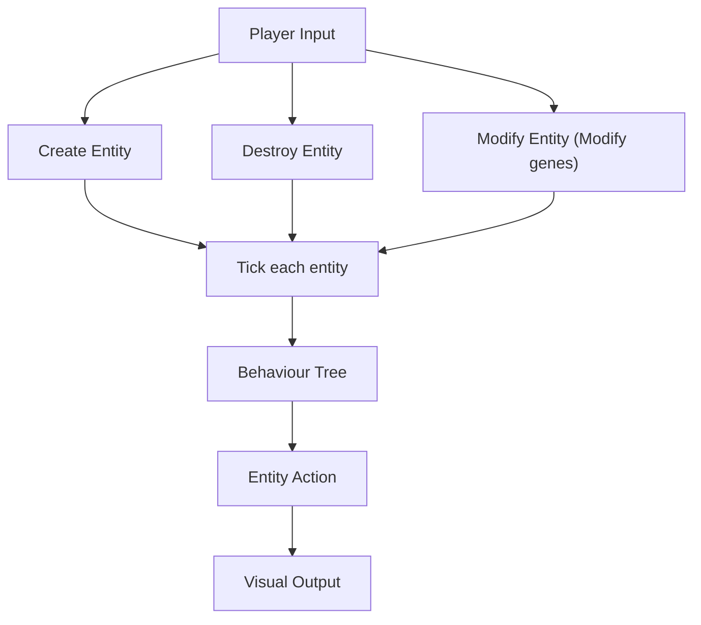
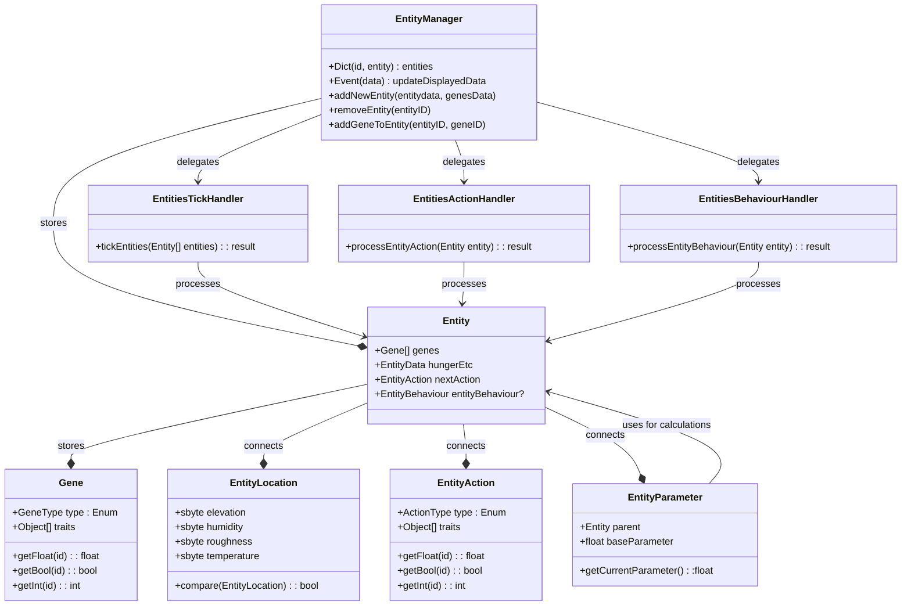
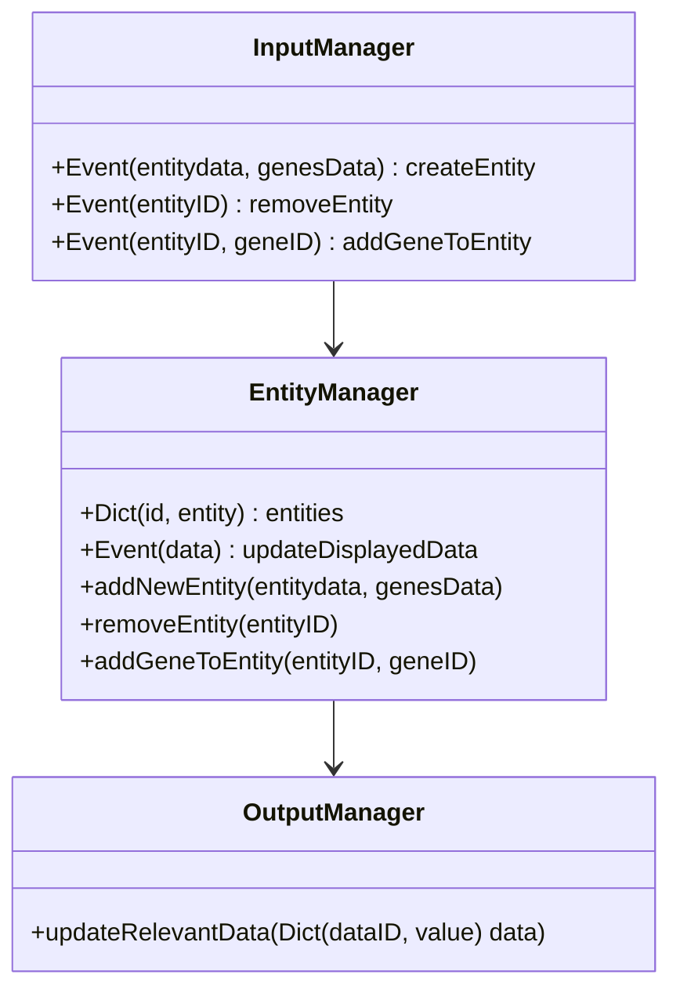

1. List of Features Captured from GDD
	- Evolutionary system
		- Entities
			- Behavior tree
			- Genes
		- Extraction and Implanting
	- Interactions between Entities
	- Entities
	- UI
		- Creating removing entities
2. Systems
	- Interactions between entities
	- Entity tracker (ticking, creating, destroying, get information about entites)
	- Splicing genes
	- User interface

