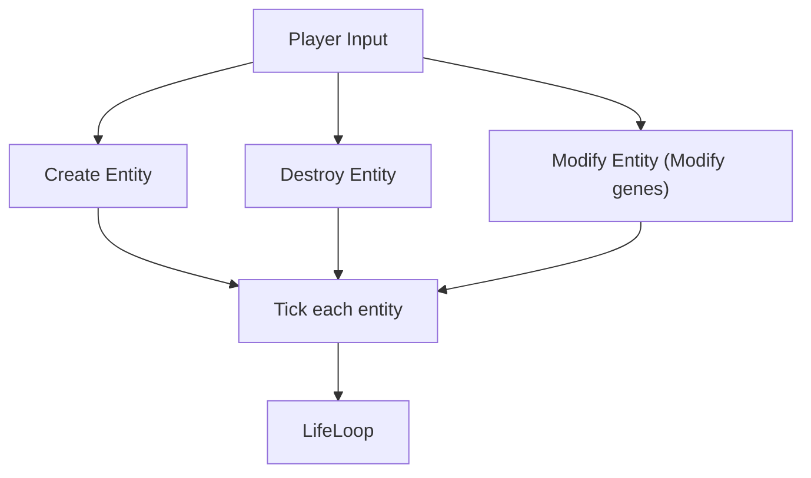
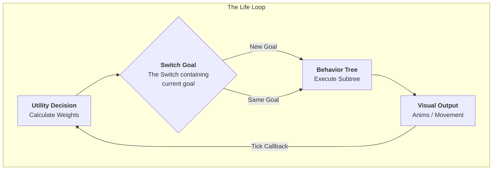
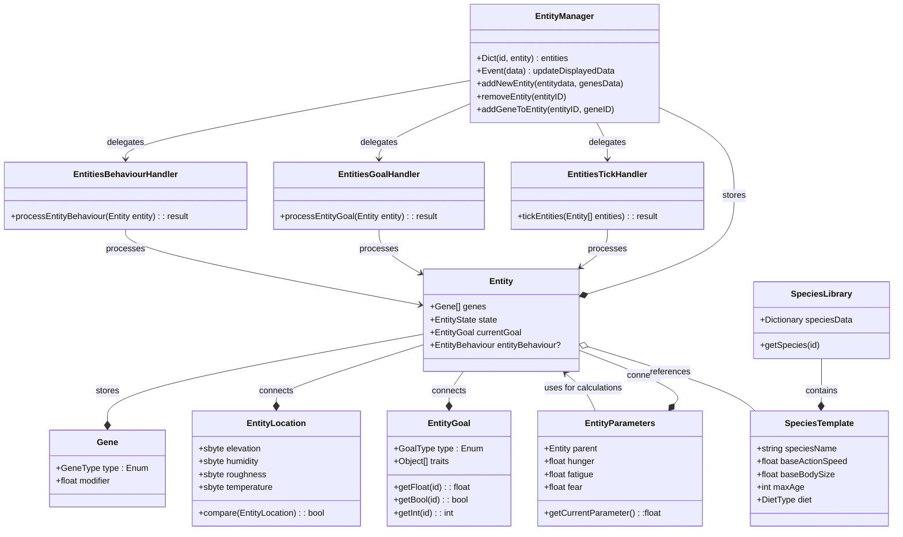
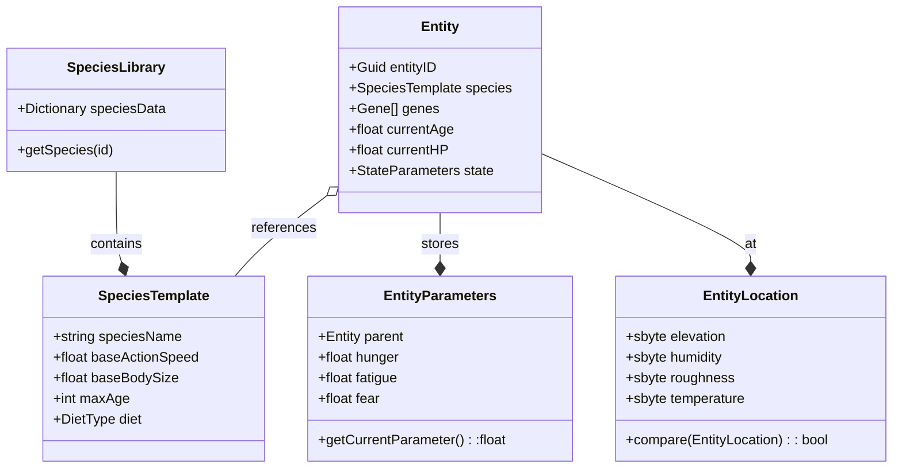
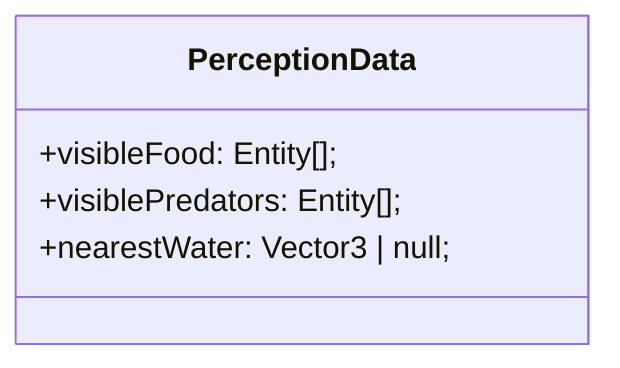

### General Loop
From [[TDD_Animals]]

##### Life Loop

### System Architecture

#### Architectural Legend
#### 1. The Data Layer (The "What")
* **Entity:** A unique ID that represents a creature. It is a "Passive Container"—it holds data but does not contain logic.
* **EntityData/State (The "Pulse"):** The current dynamic values of the creature (Hunger, Thirst, Health, Position). These change every frame.
* **Genes (The "DNA"):** The permanent traits of the creature (Brave, Fast, Glutton). These act as **Math Modifiers** for everything else.
* **Intent Holders (`currentGoal` & `entityBehaviour`):** The "bookmarks" that store what the animal decided to do and exactly which step of the process it is currently on.

#### 2. The Processing Layer (The "How")
* **EntityManager (The "Registry"):** The central database. It knows where every entity is and provides the list of animals to the Handlers. 
* **Handlers (The "Systems"):** Specialized workers that process all entities in batches.
* **EntitiesTickHandler (The "Metabolism"):** Updates the `EntityState`. It increases hunger/thirst over time based on the Genes.
* **PerceptionSystem (The "Senses"):** The "Input" for the brain. It fills the entity's memory with nearby objects (Food, Water, Predators) using the "Smell" (Proximity) logic.
* **EntitiesGoalHandler (The "Strategy"):** The **Utility Brain**. It looks at the `EntityState` and `Perception` to decide on a high-level **Goal** (e.g., "I want to Eat"). It writes this into `currentGoal`.
* **EntitiesBehaviourHandler (The "Tactics"):** The **Behavior Tree**. It looks at the `currentGoal` and executes the physical steps (e.g., "Walk to X, play animation, reduce food HP").

#### 3. The Communication Layer (The "Who")
* **InputManager:** Converts player clicks/keys into commands for the `EntityManager` (e.g., "Spawn Entity" or "Modify Genes").
* **OutputManager:** Listens to the `EntityState` and tells the Game Engine what to draw on the screen (Animations, UI Bars, Particles).

### Parameters
#### Species Library (Static Data)
These values never change during the game. All rabbits share these.
- **SpeciesID:** (e.g., "Rabbit_01")
- **Genes:** Genes shared by all of that species. 
- **Max Age:** Total life expectancy in game ticks.
* **BaseActionSpeed:** The "default" speed for this species.
* **BaseBodySize:** How big this species typically gets.
* **DietType:** (Enum: Herbivore, Carnivore, etc.)

##### Entity Instance (Personal Data)
- **EntityID**
- **Genes:** Species library genes, with additional personal genes. 
- **Current Age (0.0 - 1.0)**
    - `0 - newborn`, `1 - death of old age`, `0.2 - adulthood`, `0.5 - end of reproductive age`
- **ActionSpeed (0.0 - 1.0)**
	- *Closer to 0, the slower it is, closer to 1 the faster it is.*
	- **Impact Logic:** Should be modified by Age (babies/elderly are slower) and Fatigue.
	- **Formula Idea:** `BaseActionSpeed * (Age Curve) * (1.0 - Fatigue)`
- **BodySize (1 - 10)**
    - *The visible size of the creature.*
    - **Growth Logic:** This shouldn't be a flat number. It should be TargetSize (Gene) * AgePercent.
    - **Impact:** Larger size = higher food requirement? (Big engines need more fuel).
- **Max HP (1 - 10)**
    - Formula: `BodySize`
- **Current HP**
	 - *Damage is substracted from Current HP (avoiding healing by sleeping/fatigue lowering)*
	 - *Recovery: passively by 0.1 per 10 ticks, 0.5 for completed feeding, 0.3 per 10 ticks when sleeping*
- **Fear(0.0 to 1.0)**
	- *0.0: tranquil*
	- *0.5: scared, in smaller/skittish animals causes them to run*
	- *0.9 to 1.0: terrified, even bigger animals will be taking actions to run/take actions in response to fear*
	- *Recovery: 0.1 per tick, starts ticking down when not in danger*
- **Fatigue(0.0 to 1.0)**
	- *0.0: rested*
	- *1.0: exhausted, passes out forced to fall asleep*
- **Hunger (0.0 to 1.0)**
	- *0.0: fully satiated*
	- *1.0: starving, triggers hp loss 1 per 10 ticks*

### (ForLater)Perception & Sensory systems
To keep it simpler then messing with LOS or other BS, we will be using proximity-based detection. 

##### Query logic
Every **PerceptionInterval**, the animal asks the **SpacialSystem** 
	*"What are the nearest entities within **SmellRadius**"*
- **Logic:** Simple distance check between **Entity.Position** and **Target.Position**

##### Data Storage
Results are stored within the list inside the **Entity** as **PerceptionData**

##### Utility Interaction
[[AI#Utility Layer (The "Brain")|Utility]] uses this data to calculate weights 
	*Examples:*
	- If *visiblePredator* is not empty, set *FearWeight* to 1.0
	- If *visibleFood* has 3 items, set *FoodAvailabilityScore* to 1.0