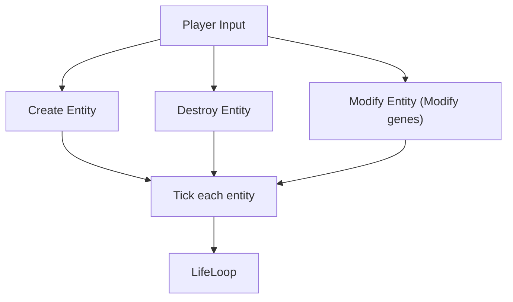
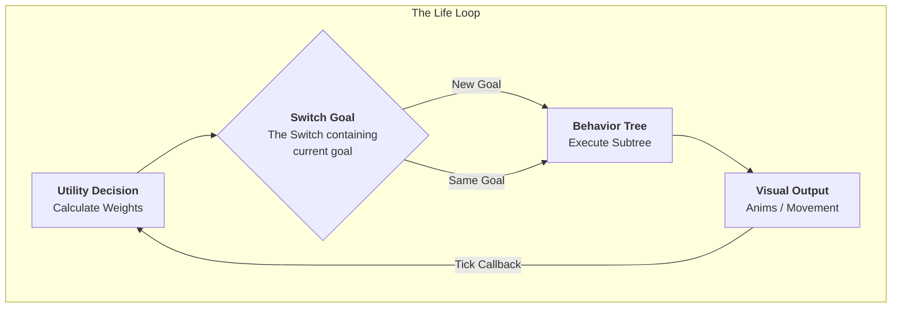
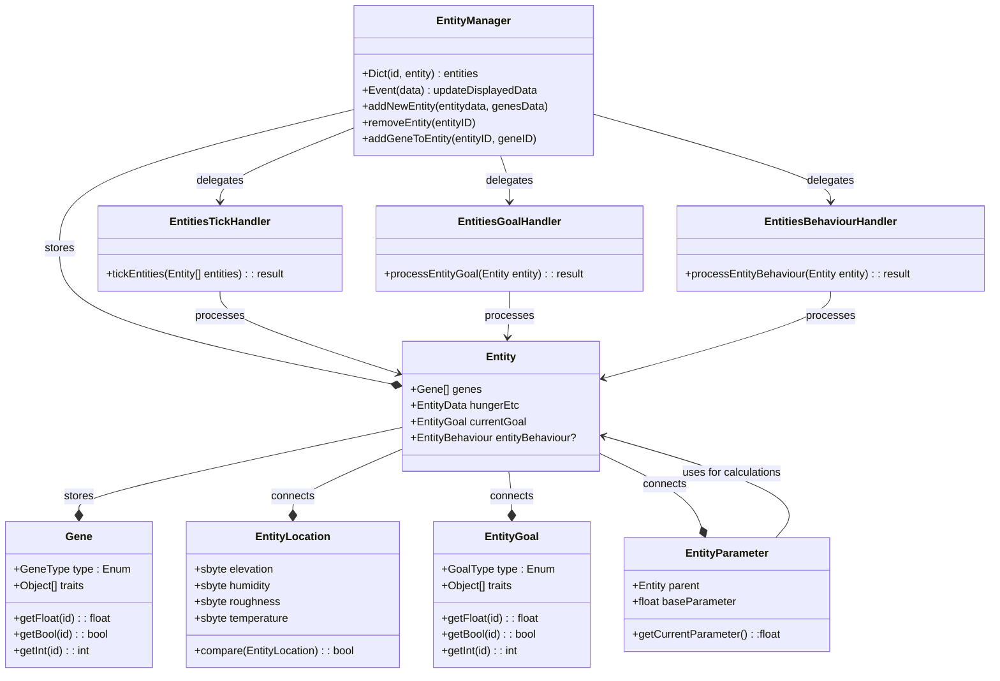
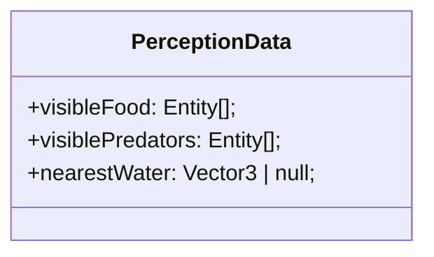

### General Loop
From [[TDD_Animals]]

##### Life Loop

### System Architecture
1. **Entity:** A unique ID that

### Architectural Legend

#### 1. The Data Layer (The "What")
* **Entity:** A unique ID that represents a creature. It is a "Passive Container"—it holds data but does not contain logic.
* **EntityData/State (The "Pulse"):** The current dynamic values of the creature (Hunger, Thirst, Health, Position). These change every frame.
* **Genes (The "DNA"):** The permanent traits of the creature (Brave, Fast, Glutton). These act as **Math Modifiers** for everything else.
* **Intent Holders (`currentGoal` & `entityBehaviour`):** The "bookmarks" that store what the animal decided to do and exactly which step of the process it is currently on.

#### 2. The Processing Layer (The "How")
* **EntityManager (The "Registry"):** The central database. It knows where every entity is and provides the list of animals to the Handlers. 
* **Handlers (The "Systems"):** Specialized workers that process all entities in batches.
* **EntitiesTickHandler (The "Metabolism"):** Updates the `EntityState`. It increases hunger/thirst over time based on the Genes.
* **PerceptionSystem (The "Senses"):** The "Input" for the brain. It fills the entity's memory with nearby objects (Food, Water, Predators) using the "Smell" (Proximity) logic.
* **EntitiesGoalHandler (The "Strategy"):** The **Utility Brain**. It looks at the `EntityState` and `Perception` to decide on a high-level **Goal** (e.g., "I want to Eat"). It writes this into `currentGoal`.
* **EntitiesBehaviourHandler (The "Tactics"):** The **Behavior Tree**. It looks at the `currentGoal` and executes the physical steps (e.g., "Walk to X, play animation, reduce food HP").

#### 3. The Communication Layer (The "Who")
* **InputManager:** Converts player clicks/keys into commands for the `EntityManager` (e.g., "Spawn Entity" or "Modify Genes").
* **OutputManager:** Listens to the `EntityState` and tells the Game Engine what to draw on the screen (Animations, UI Bars, Particles).

### (ForLater)Perception & Sensory systems
To keep it simpler then messing with LOS or other BS, we will be using proximity-based detection. 

##### Query logic
Every **PerceptionInterval**, the animal asks the **SpacialSystem** 
	*"What are the nearest entities within **SmellRadius**"*
- **Logic:** Simple distance check between **Entity.Position** and **Target.Position**

##### Data Storage
Results are stored within the list inside the **Entity** as **PerceptionData**

##### Utility Interaction
[[AI#Utility Layer (The "Brain")|Utility]] uses this data to calculate weights 
	*Examples:*
	- If *visiblePredator* is not empty, set *FearWeight* to 1.0
	- If *visibleFood* has 3 items, set *FoodAvailabilityScore* to 1.0