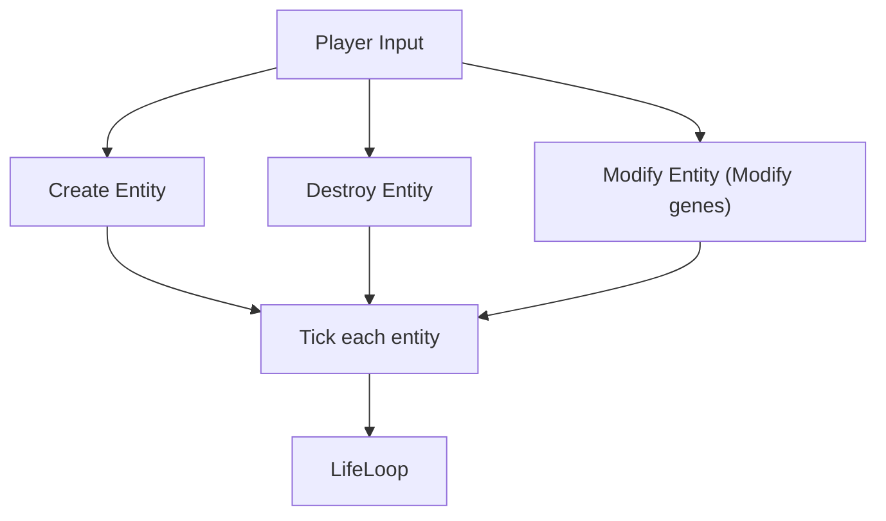
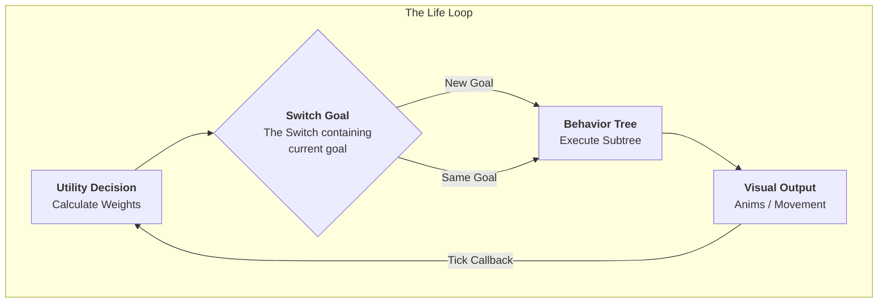

#### General Loop
From [[TDD_Animals]]

```mermaid
flowchart TD

	Input[Player Input]
	CE[Create Entity]
	DE[Destroy Entity]
	ME["Modify Entity (Modify genes)"]
	LL[LifeLoop]
	Tick[Tick each entity]
	
    Input --> CE
    Input --> DE
    Input --> ME
    CE --> Tick
    DE --> Tick
    ME --> Tick
    Tick --> LL
     
```

##### Life Loop

```mermaid
flowchart TD
	subgraph "The Life Loop"
	    Utility[<b>Utility Decision</b><br/>Calculate Weights]
        Switch{<b>Switch Goal</b><br/> The Switch containing current goal}
        BT[<b>Behavior Tree</b><br/>Execute Subtree]
        Output[<b>Visual Output</b><br/>Anims / Movement]
    
        Utility --> Switch
        Switch -- "New Goal" --> BT
        Switch -- "Same Goal" --> BT
        BT --> Output
        Output -- "Tick Callback" --> Utility
        end
```

