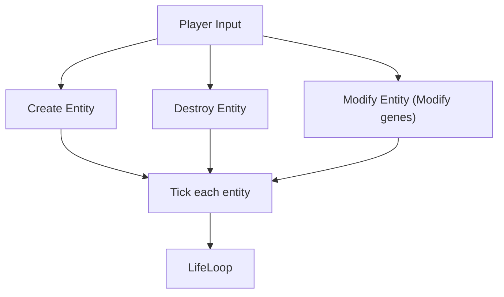
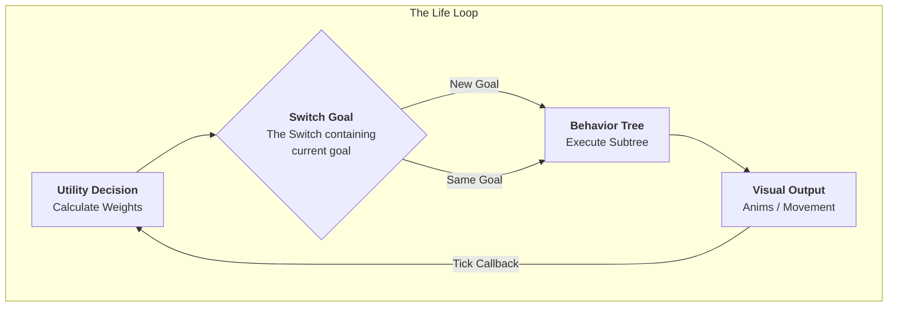
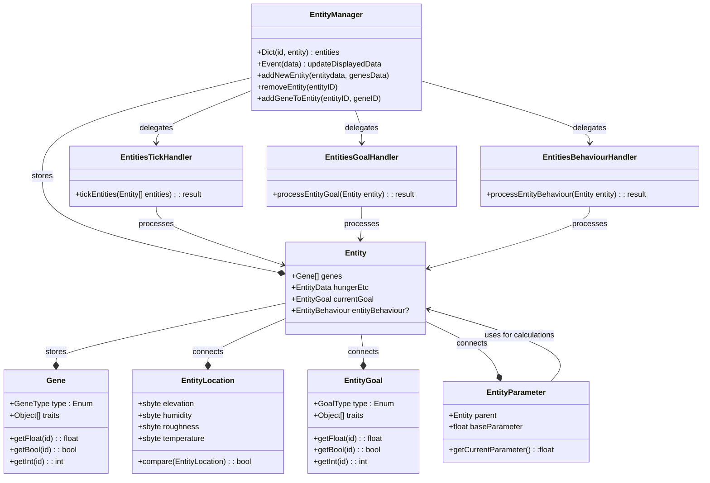
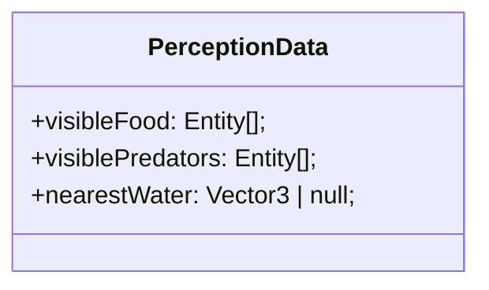

### General Loop
From [[TDD_Animals]]

##### Life Loop

### System Architecture

### (ForLater)Perception & Sensory systems
To keep it simpler then messing with LOS or other BS, we will be using proximity-based detection. 

##### Query logic
Every **PerceptionInterval**, the animal asks the **SpacialSystem** 
	*"What are the nearest entities within **SmellRadius**"*
- **Logic:** Simple distance check between **Entity.Position** and **Target.Position**

##### Data Storage
Results are stored within the list inside the **Entity** as **PerceptionData**

##### Utility Interaction
[[AI#Utility Layer (The "Brain")|Utility]] uses this data to calculate weights 
	*Examples:*
	- If *visiblePredator* is not empty, set *FearWeight* to 1.0
	- If *visibleFood* has 3 items, set *FoodAvailabilityScore* to 1.0